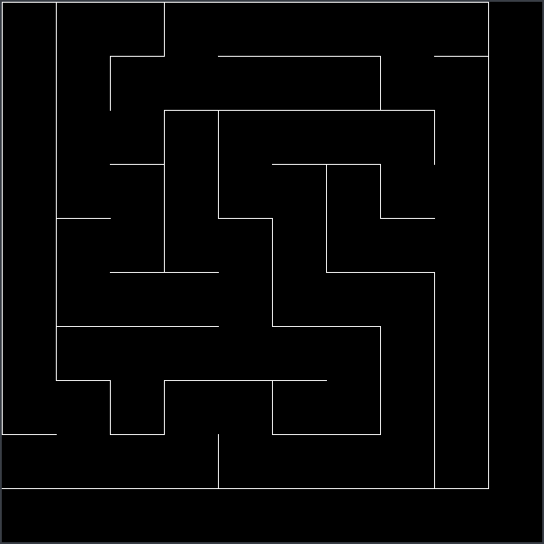
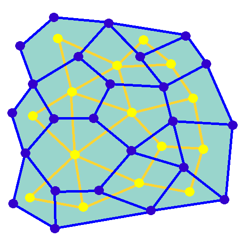

<h1 align="center">Labyrinthe pygame</h1>

### But du projet

- **Avoir un labyrinthe de taille k possédant une arrivée et une fin**
- **Une implémentation en arbre ou en graphe**
- **Une solution pour le labyrinthe créé**
- **Une interface pygame**
- **Un joueur doit pouvoir se déplacer dans le labirynthe**

### Génération du labirynthe

  

### Fonctionnement du labyrinthe
- **Deux graphes rectangulaires sont créés, un externe et un interne**
- **Le graphe interne se situe "à l'intérieur" du graphe externe**
- **On parcourt de façon aléatoire le graphe interne**
- **A chaque parcours entre deux sommets adjacents,**
- **L'arc "coupé" du graphe externe par le graphe interne est supprimé**
- **Ainsi on obtient le schéma suivant (il faut imaginer les deux graphes comme des grilles):**

### Création de la solution

- **Lors du parcours du graphe interne on retient l'ordre de passage dans une liste**
- **A partir du moment où le sommet actuel est celui devant la sortie, on s'arrête**
- **En appuyant sur F1 on dessine la solution**

### Déplacement du joueur

- **On place le joueur sur un sommet du graphe interne**
- **On regarde ainsi si il y a un mur (un arc) avec le graphe externe**
- **S'il n'y en a pas, le joueur bouge, sinon il reste sur place**
